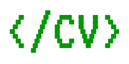

# 
Manage your resume as structured data.

This project has two sides:
* CV format specification and documentation
* Reference tool to cover the basis of CV maintenance

Here you can see a [3 min quick demo](https://youtu.be/t4aOSJibuzs).

## 💻 Install
1. Download the latest binary from the [releases page](https://github.com/hexagonkt/codecv/releases)
2. Copy or link the binary to a directory in the PATH
3. Type `codecv --help` to check how to use the reference tool

## 🤔 Motivation
The format was developed and evolved with the simple requirement to store and maintain my own CV.

The main driver for this development was to separate content from presentation. Also using open
standards that prevented the need to keep documents updated upon new Word Processor versions.

Over the years my CV has become big and the need to split it in different files and provide
different versions has arisen (i.e.: a brief version and a full one, one with partial education and
other only with finished degrees, etc.). So a modular approach has been implemented to fulfill this
requirement.

## 🎯 Goals
1. Readable CVs in code form
2. Leverage existing editors features (use a JSON schema version widely supported)
3. Allow documents to be imported and exported easily from/to other sites
4. Create documents in a flexible way. Composing files to make your CV modular.
5. Not only state your career's details, but also record details of what happened (i.e.: why you
   quit a job, etc.). You can think of it as a professional diary
6. Batteries included: provide a reference tool to manage and maintain CV documents

## ♻️ Differences with other CV formats
* Allow to compose CVs in a modular way (including different files to create profiles) creating
  different views from the data
* It is field compatible with other formats as [JSON Resume], [Eures] and [Manfred MAC]
  (import/export functionality pending)

[JSON Resume]: https://jsonresume.org
[Eures]: https://eures.ec.europa.eu/index_en
[Manfred MAC]: https://github.com/getmanfred/mac

## 📄 CV Format Schema
The CV JSON schema is located at [/cv.schema.json](/cv.schema.json). The URL to use on the CVs will
be: `https://raw.githubusercontent.com/hexagonkt/codecv/<version>/cv.schema.json`. Being `version`
the schema version (`master` can be used to link to the latest published version).

The schema can be used to validate documents in different formats (YAML, JSON and TOML at the
moment).

The format allows the use of the `$schema` key to reference the schema URL (this key is used by some
editors to attach a schema to a file).

Some formats (YAML and TOML) allow the use of a ['shebang'][shebang] to make them "executable" and
launch the CV server automatically upon execution. Check the examples for more information.

The schema is also published in the [JSON Schema Repository](https://www.schemastore.org/json). This
means that CV documents will be supported out of the box at some code editors (most notably
[VS Code] and [JetBrains IDEs]).

It implies that you will get autocomplete, documentation and validation for the following file
patterns:
- `cv.{json,yaml,yml,toml}`
- `*.cv.{json,yaml,yml,toml}`

Follow the @hexagon_kt Twitter account to be updated with the improvements on this and other
development tools.

Files can end with a locale code
- *\[en_US].cv.yaml (cv)
- *\[en_US].cv.json (cv)

[shebang]: https://en.wikipedia.org/wiki/Shebang_(Unix)
[VS Code]: https://code.visualstudio.com
[JetBrains IDEs]: https://www.jetbrains.com

## 🧰 Examples
You can check some CV examples (in different formats) on the [/examples](/examples) directory.

There are some modular CVs definitions in the [/examples/modular](/examples/modular) directory.
These CV files use the `Resources` key to include different files in different cv documents,
allowing to have different documents with different data each one.

## 🎨 Templates
The templates are attached to documents with the `Templates` key (each document can get a different
template).

A sample template is provided as an example and a reference to create different ones. The template
engine used to render it is the [Pebble Template Engine].

[Pebble Template Engine]: https://pebbletemplates.io

## 🤖 Reference Tool
Compiling this project you will get an application with the following features:
* Change a CV file data format (among JSON and YAML)
* Check the schema documentation in HTML
* Render a CV to a Web page (allowing it to be printed)

To compile this tool you will need a JDK 16+. After installing it, executing `gradlew build` on the
project root directory will create a binary on `/build/codecv/bin/codecv`.

To use the tool in CVs' [shebangs][shebang] you need to copy or link the binary to a directory in
the `$PATH` variable. On Unix systems you can do so with (assuming `~/.local/bin` is in the path):
`ln -s "$(pwd)/build/codecv/bin/codecv" "$HOME/.local/bin/cv"`

## 🎚️️ Editor Settings
JSON schemas are assigned to files based on patterns registered on a [central repository]. As the
CodeCV format is not registered there yet, you may have to register it on your editor of choice.

However, some editors (most notably Visual Studio Code) support schema binding via the `$schema` key
on the documents, if your editor support this convention, you won't need to change its settings.

[central repository]: https://www.schemastore.org/json

## 🤝 Contributing
This project is Open Source under the [MIT License](license.md). If you want to propose an
improvement, file a bug or resolve a usage doubt, you are absolutely encouraged to do so! Read the
[contributing guide] for details on how to proceed on each case.

Also, if you want to contribute a new feature on the tool or a change on the schema. You can also
do so by creating an issue and filing a PR. Please read the [contributing guide] before doing so.

[contributing guide]: https://github.com/hexagonkt/codecv/contribute

## ❤️ Support the Project
If you want to see more progress on this project, and see more developer targeted tools,
spread the word on social networks! and don't forget to give it a ⭐!

To be notified on updates or new tools developed within the Hexagon organization. Follow the Twitter
account ([@hexagon_tk]) and the [GitHub organization].

Thanks for your support!

[@hexagon_tk]: https://twitter.com/hexagon_kt
[GitHub organization]: https://github.com/hexagonkt

# TODO
* Scenarios for modular CVs. I.e.: different target jobs
* Translations how-to
